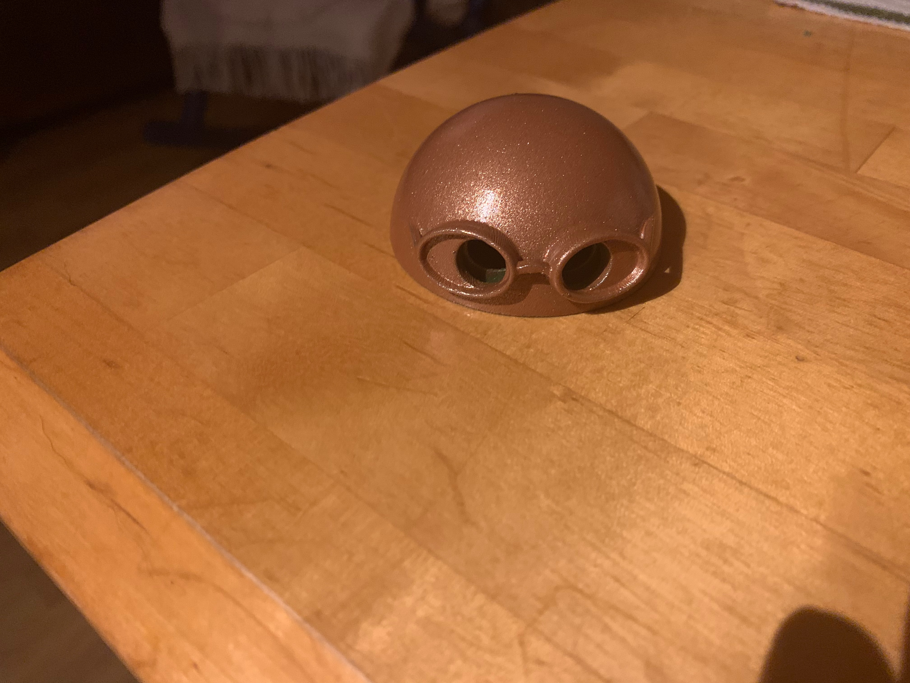

# 🤖 Bruno - 3D Printed Theater Control Robot



Bruno is a retro-futuristic robotic remote controller for professional theater smoke machines. Designed as the ultimate backup solution when digital systems fail during live performance.

## 📸 Gallery

### Final Product


### Operation Videos
- [Bruno Operation Demo](videos/bruno-operation.mp4) - Main functionality demonstration
- [Bruno Assembly Process](videos/bruno-assembly.avi) - Build process documentation  
- [Latest Development](videos/bruno-latest.avi) - Most recent improvements

## 🎯 Design Goals

- **Reliable Manual Override**: Physical button always works when WiFi fails
- **Intuitive Operation**: "Lift head → press button" - anyone can operate
- **Professional Aesthetics**: Looks at home in a theater control booth
- **Robust Construction**: Survives the chaos of live theater

## 🛠️ Technical Specifications

### Electronics Integration
- **ESP32 WROOM-32**: Main controller
- **SSD1306 OLED Display**: Animated "eyes" showing system status
- **433MHz Radio Module**: Wireless communication to smoke machines
- **Tactile Button**: Hidden under removable head section
- **Li-Po Battery**: Rechargeable power with USB-C charging

### Physical Design
- **Material**: PLA+ (high strength, good layer adhesion)
- **Dimensions**: 120mm x 80mm x 160mm (W x D x H)
- **Weight**: ~380g with electronics
- **Print Time**: ~18 hours total across all parts
- **Support Material**: Minimal, designed for FDM printing

## 📋 Parts List

### 3D Printed Components
- [x] `bruno-head.stl` - Main head assembly (Bruno's distinctive neck/head design)
- [x] `brunokaula.3mf` - Original 3MF project file
- [x] `kaula2.3mf` - Design iteration 2
- [x] `kaula3.3mf` - Design iteration 3  
- [x] `kaula4.3mf` - Design iteration 4
- [x] `kaula5.3mf` - Final optimized design
- [x] `ffff.3mf` - Additional component variant

### Hardware (Non-Printed)
- [ ] M3 x 12mm screws (x6)
- [ ] M3 x 8mm screws (x4)
- [ ] M3 nuts (x8)
- [ ] Heat-set inserts M3 (x4)

## 🔧 Assembly Instructions

### Step 1: Electronics Preparation
1. Flash `robotti_433mhz.ino` to ESP32
2. Test OLED display functionality
3. Calibrate 433MHz transmission range

### Step 2: Physical Assembly
1. Install heat-set inserts in body mounting points
2. Mount ESP32 and OLED in body cavity
3. Route wiring through internal channels
4. Install button mechanism in head assembly

### Step 3: Final Integration
1. Calibrate button pressure for reliable actuation
2. Test full wireless operation with smoke machine
3. Verify battery life (target: 8+ hours operation)

## 🎭 Theater Integration

Bruno integrates seamlessly with the larger MIDI theater control system:

### Normal Operation
```
Multiplay → HTTP API → ESP32 Smoke Machine → Physical Smoke
```

### Backup Mode (Bruno Active)  
```
Bruno Button → 433MHz → ESP32 Smoke Machine → Physical Smoke
```

### Status Indication
- **Normal Eyes**: System operating normally
- **X X Eyes**: WiFi disconnected - backup needed
- **Alert Animation**: Low battery warning

## 🎨 Design Evolution

### Version 1.0: Proof of Concept
- Basic rectangular housing
- External wiring visible
- Functional but not production-ready

### Version 2.0: Retro-Futuristic Design
- Art Deco inspired curves and angles
- Hidden internal wiring
- Professional finish suitable for theater environment

### Version 3.0: Current (Manufacturing Ready)
- Optimized for FDM printing
- Serviceability improvements  
- Enhanced durability for professional use

## 🏆 Professional Impact

Bruno demonstrates advanced technical skills valuable in professional environments:

- **Product Design**: From concept to manufacturable product
- **Systems Integration**: Hardware + software + user experience
- **Professional Documentation**: Production-ready specifications
- **Problem Solving**: Elegant solution to real-world reliability challenges

## 📁 Files in This Directory

```
bruno-robot/
├── README.md                    # This file
├── photos/
│   └── bruno-hero.jpg          # Main promotional image
├── videos/
│   ├── bruno-operation.mp4     # Full operation demonstration
│   ├── bruno-assembly.avi      # Assembly process documentation
│   └── bruno-latest.avi        # Latest development updates
└── stl-files/
    ├── bruno-head.stl          # Main head/neck assembly
    ├── brunokaula.3mf          # Original 3MF project file
    ├── kaula2.3mf              # Design iteration 2
    ├── kaula3.3mf              # Design iteration 3
    ├── kaula4.3mf              # Design iteration 4
    ├── kaula5.3mf              # Final optimized design
    └── ffff.3mf                # Additional component variant
```

## 🚀 Future Enhancements

- **RGB Accent Lighting**: Controllable mood lighting
- **Voice Alerts**: Audio feedback for status changes  
- **Modular Accessories**: Swappable personality modules
- **Production Scaling**: Injection molding tooling design

---

*Bruno is more than a 3D printing project - it's a complete product design showcasing the intersection of engineering, aesthetics, and practical problem-solving in professional theater environments.*