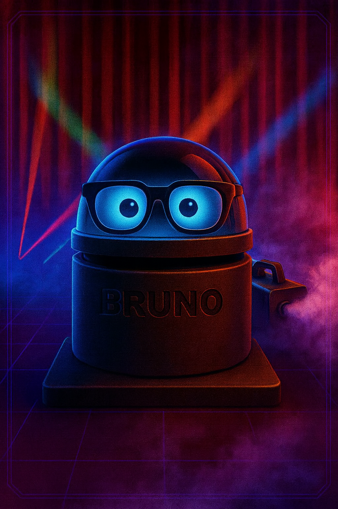

# 🤖 Meet BRUNO - Our Theater Remote Hero



**B**ig **R**emote **U**niversal **N**avigator **O**perator

Bruno is the heart of our professional theater smoke machine control system. This retro-futuristic remote controller combines cutting-edge ESP32 technology with synthwave aesthetics to deliver reliable, instant smoke effects for live performances.

## 🎭 Bruno's Features

### 👁️ **Expressive OLED Eyes** 
- Normal operation: Animated eye movements
- Connection lost: X X eyes (visual feedback)
- Status display: WiFi, battery, commands sent

### 📻 **433MHz Radio Communication**
- 15+ meter range through theater walls
- No WiFi conflicts with other equipment
- <100ms latency for instant smoke triggers
- Professional theater-grade reliability

### 🎮 **Simple Operation**
- **Lift head** → reveals hidden button
- **Press button** → instant smoke activation  
- **OLED confirmation** → "SMOKE SENT!" message
- **Automatic timeout** → 5-second safe operation

### 🔋 **Portable & Reliable**
- Powerbank operation for hours of use
- ESP32 brain with Arduino programming
- SSD1306 128x32 OLED display
- Professional theater construction

## 🎪 Bruno in Action

Bruno serves as the **backup control system** when the primary Multiplay automation fails. Theater operators can rely on Bruno's simple "lift and press" operation to maintain perfect show timing even in technical emergencies.

### Control Hierarchy:
1. **Multiplay HTTP** → Automated show control (primary)
2. **Bruno 433MHz** → Manual backup control (secondary)  
3. **Manual button** → Emergency local control (tertiary)
4. **Direct smoke machine** → Last resort (manual)

## 🛠️ Technical Specifications

- **Controller**: ESP32 (WiFi + 433MHz capable)
- **Display**: SSD1306 OLED 128x32 pixels
- **Radio**: 433MHz transmitter (50-100m range)
- **Power**: USB powerbank (8+ hours operation)
- **Interface**: Single button (hidden under head)
- **Status LEDs**: Blue (normal) + Red (error/offline)

## 📡 Communication Protocol

Bruno uses the **rc-switch** library to send standardized 433MHz codes:

```cpp
SMOKE_PULSE_CODE = 11111  // 5-second smoke burst
SMOKE_ON_CODE = 12345     // Continuous smoke  
SMOKE_OFF_CODE = 54321    // Emergency stop
```

## 🎨 Design Philosophy

Bruno embodies the **retro-futuristic theater aesthetic** - combining nostalgic synthwave visuals with modern IoT functionality. The design suggests both **reliability** (professional theater equipment) and **approachability** (friendly robot companion).

The transparent dome head with glowing blue eyes creates an **emotional connection** between operator and device, making technical theater operations more intuitive and less stressful during live performances.

---

**Bruno isn't just a remote control - he's your trusted theater companion! 🎭✨**

*Glamour shot created with AI assistance - capturing Bruno's synthwave soul perfectly!*